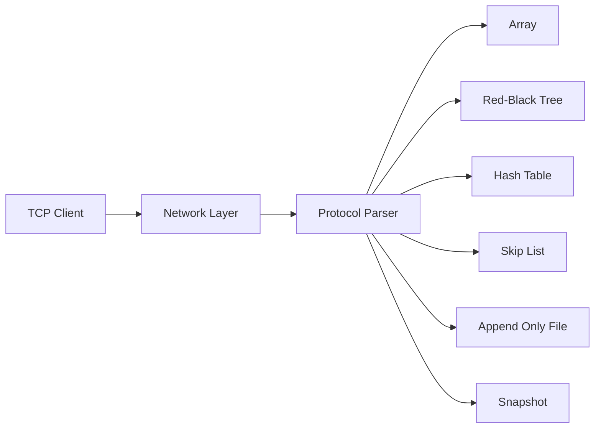

<div align="center">

```text
 █████╗  ██╗  ██╗  ██╗██╗   ██╗███████╗████████╗ ██████╗ ██████╗ ███████╗
██╔══██╗███║  ██║ ██╔╝██║   ██║██╔════╝╚══██╔══╝██╔═══██╗██╔══██╗██╔════╝
╚██████║╚██║  █████╔╝ ██║   ██║███████╗   ██║   ██║   ██║██████╔╝█████╗
 ╚═══██║ ██║  ██╔═██╗ ╚██╗ ██╔╝╚════██║   ██║   ██║   ██║██╔══██╗██╔══╝
 █████╔╝ ██║  ██║  ██╗ ╚████╔╝ ███████║   ██║   ╚██████╔╝██║  ██║███████╗
 ╚════╝  ╚═╝  ╚═╝  ╚═╝  ╚═══╝  ╚══════╝   ╚═╝    ╚═════╝ ╚═╝  ╚═╝╚══════╝
```

**Simple · Modular · Persistent**

一个使用 C 语言构建的模块化键值数据库

A modular key-value database built in C

**🚧 正在迭代中 · Actively Evolving**

[中文](#中文) · [English](#english)

</div>

---

<a id="中文"></a>

## 中文

91kvstore 是一个使用 C 语言从底层构建的键值数据库产品。它提供多种存储引擎、可切换的网络模型、AOF 日志、数据快照和节点内存池，并通过轻量的 TCP 文本协议对外提供服务。

项目正在迭代中，目标是打造一个结构清晰、性能可测、易于部署和扩展的 KV 数据库。当前 API、协议和内部实现仍可能随版本演进而调整。

### 核心能力

- 四种存储引擎：Array、Red-Black Tree、Hash Table、Skip List
- 三种网络模型：Reactor、Proactor（io_uring）和 NtyCo 协程
- 基于 TCP 的轻量文本协议
- AOF 实时写入与启动重放
- 手动快照保存及启动恢复
- Hash、Red-Black Tree 和 Skip List 节点内存池
- AddressSanitizer 内存检查与分配性能基准
- Python、Go、JavaScript、Java 和 Rust 客户端示例

### 架构



### 项目结构

```text
91kvstore/
├── clients/                 # 多语言 TCP 客户端示例
├── include/                 # 公共头文件
├── src/
│   ├── engines/             # Array / RBTree / Hash / SkipList
│   ├── memory/              # 内存池
│   ├── network/             # Reactor / Proactor / NtyCo
│   ├── persistence/         # AOF 与 Snapshot
│   └── kvstore.c            # 协议、初始化与程序入口
├── tests/                   # 测试与性能基准
├── third_party/NtyCo/       # NtyCo Git 子模块
└── Makefile
```

### 环境要求

当前版本面向 Linux 构建，使用 epoll、io_uring 等 Linux 接口。

- GCC（支持 GNU C11）
- GNU Make
- pthread
- liburing
- Git

Ubuntu/Debian：

```bash
sudo apt update
sudo apt install -y build-essential git liburing-dev
```

### 快速开始

```bash
git clone --recursive https://github.com/JasperStonnne/91kvstore.git
cd 91kvstore
make
./bin/kvstore 2000
```

如果仓库已经克隆但缺少子模块：

```bash
git submodule update --init --recursive
```

服务默认监听所有网络接口。`appendonly.aof` 和 `snapshot.db` 会从服务启动时的工作目录读取或写入。

使用 `nc` 连接：

```bash
nc 127.0.0.1 2000
```

```text
HSET username jasper
OK
HGET username
jasper
HMOD username stone
OK
HEXIST username
EXIST
HDEL username
OK
```

键和值当前应为不包含空格的文本。

### 命令协议

命令前缀决定请求使用的存储引擎：

| 操作 | Array | Red-Black Tree | Hash Table | Skip List |
| --- | --- | --- | --- | --- |
| 新增 | `SET key value` | `RSET key value` | `HSET key value` | `SSET key value` |
| 查询 | `GET key` | `RGET key` | `HGET key` | `SGET key` |
| 删除 | `DEL key` | `RDEL key` | `HDEL key` | `SDEL key` |
| 修改 | `MOD key value` | `RMOD key value` | `HMOD key value` | `SMOD key value` |
| 判断存在 | `EXIST key` | `REXIST key` | `HEXIST key` | `SEXIST key` |

`SET` 仅新增不存在的键；修改已有值需要使用对应的 `MOD` 命令。

| 响应 | 含义 |
| --- | --- |
| `OK` | 操作成功 |
| `EXIST` | 键已经存在，或存在性检查为真 |
| `NO EXIST` | 键不存在 |
| `ERROR` | 操作失败 |

创建数据快照：

```text
SAVE
```

快照保存在 `snapshot.db`。服务重启时会先加载快照，再从快照记录的位置继续重放 `appendonly.aof`。

### 网络模型

在 `include/kvstore.h` 中通过 `NETWORK_SELECT` 选择网络模型，当前默认为 NtyCo：

```c
#define NETWORK_REACTOR  0
#define NETWORK_PROACTOR 1
#define NETWORK_NTYCO    2

#define NETWORK_SELECT NETWORK_NTYCO
```

修改后执行 `make clean && make` 重新编译。

### 内存池配置

Hash、Red-Black Tree 和 Skip List 默认启用节点内存池：

```bash
make clean
make HASH_USE_MEMORY_POOL=0 \
     RBTREE_USE_MEMORY_POOL=0 \
     SKIPLIST_USE_MEMORY_POOL=0
```

| Make 变量 | 默认值 | 作用 |
| --- | ---: | --- |
| `HASH_USE_MEMORY_POOL` | `1` | Hash 节点使用内存池 |
| `RBTREE_USE_MEMORY_POOL` | `1` | 红黑树节点使用内存池 |
| `SKIPLIST_USE_MEMORY_POOL` | `1` | 跳表节点使用内存池 |
| `ARRAY_USE_JEMALLOC` | `0` | Array 基准使用 jemalloc |

### 测试

```bash
make test-memory-pool
make test-hash-memory-pool
make test-rbtree-memory-pool
make test-skiplist-memory-pool
make test-array-memory
```

TCP 功能与压力测试：

```bash
make testcase
./bin/testcase 127.0.0.1 2000 <mode>
```

| mode | 测试内容 |
| ---: | --- |
| `0` | 红黑树重复操作 |
| `1` | 红黑树批量键操作 |
| `2` | Array 重复操作 |
| `3` | Hash 分配与删除 |
| `4` | Skip List 重复操作 |

以 Hash 引擎为例，对比内存池与 `malloc`：

```bash
make HASH_USE_MEMORY_POOL=1 benchmark-hash
./bin/benchmark_hash_allocator

make HASH_USE_MEMORY_POOL=0 benchmark-hash
./bin/benchmark_hash_allocator
```

其他基准目标包括 `benchmark-rbtree`、`benchmark-skiplist`、`benchmark-array` 及对应的 `*-memory` 目标。

### 开发状态

91kvstore 正在积极开发。正式生产版本发布前计划继续完善：

- 非法命令和参数的完整校验
- 自动化测试与 CI
- 并发安全和优雅退出
- 身份认证、访问控制与加密传输
- AOF 重写、自动快照及可配置的数据目录
- 统一的命令行客户端
- 可复现的性能与稳定性测试报告

### License

本仓库目前尚未声明开源许可证。在许可证发布前，保留所有权利。

---

<a id="english"></a>

## English

91kvstore is a key-value database product built from the ground up in C. It combines multiple storage engines, selectable networking models, AOF persistence, snapshots, and node memory pools behind a lightweight TCP text protocol.

The project is actively evolving, with the goal of becoming a well-structured, measurable, deployable, and extensible KV database. APIs, the protocol, and internal implementations may change as the project progresses.

### Core capabilities

- Four storage engines: Array, Red-Black Tree, Hash Table, and Skip List
- Three networking models: Reactor, Proactor with io_uring, and NtyCo coroutines
- Lightweight TCP text protocol
- Synchronous AOF writes and replay on startup
- Manual snapshots and startup recovery
- Node memory pools for Hash, Red-Black Tree, and Skip List
- AddressSanitizer checks and allocation benchmarks
- Example clients in Python, Go, JavaScript, Java, and Rust

### Requirements

The current version targets Linux and uses APIs such as epoll and io_uring.

- GCC with GNU C11 support
- GNU Make
- pthread
- liburing
- Git

On Ubuntu/Debian:

```bash
sudo apt update
sudo apt install -y build-essential git liburing-dev
```

### Quick start

```bash
git clone --recursive https://github.com/JasperStonnne/91kvstore.git
cd 91kvstore
make
./bin/kvstore 2000
```

If the repository was cloned without submodules:

```bash
git submodule update --init --recursive
```

The server listens on all network interfaces. `appendonly.aof` and `snapshot.db` are read from and written to the working directory in which the server is started.

Connect with `nc`:

```bash
nc 127.0.0.1 2000
```

```text
HSET username jasper
OK
HGET username
jasper
HMOD username stone
OK
HEXIST username
EXIST
HDEL username
OK
```

Keys and values currently need to be text without spaces.

### Command protocol

The command prefix selects the storage engine:

| Operation | Array | Red-Black Tree | Hash Table | Skip List |
| --- | --- | --- | --- | --- |
| Create | `SET key value` | `RSET key value` | `HSET key value` | `SSET key value` |
| Read | `GET key` | `RGET key` | `HGET key` | `SGET key` |
| Delete | `DEL key` | `RDEL key` | `HDEL key` | `SDEL key` |
| Update | `MOD key value` | `RMOD key value` | `HMOD key value` | `SMOD key value` |
| Check existence | `EXIST key` | `REXIST key` | `HEXIST key` | `SEXIST key` |

`SET` only creates a key that does not already exist. Use the corresponding `MOD` command to update an existing value.

| Response | Meaning |
| --- | --- |
| `OK` | The operation succeeded |
| `EXIST` | The key already exists, or an existence check is true |
| `NO EXIST` | The key does not exist |
| `ERROR` | The operation failed |

Create a snapshot with:

```text
SAVE
```

The snapshot is stored in `snapshot.db`. On restart, the server loads the snapshot first and resumes replaying `appendonly.aof` from the offset recorded in the snapshot.

### Selecting a networking model

Set `NETWORK_SELECT` in `include/kvstore.h`. NtyCo is currently the default:

```c
#define NETWORK_REACTOR  0
#define NETWORK_PROACTOR 1
#define NETWORK_NTYCO    2

#define NETWORK_SELECT NETWORK_NTYCO
```

Run `make clean && make` after changing the selection.

### Memory pool configuration

Node memory pools are enabled by default for Hash, Red-Black Tree, and Skip List:

```bash
make clean
make HASH_USE_MEMORY_POOL=0 \
     RBTREE_USE_MEMORY_POOL=0 \
     SKIPLIST_USE_MEMORY_POOL=0
```

| Make variable | Default | Purpose |
| --- | ---: | --- |
| `HASH_USE_MEMORY_POOL` | `1` | Use the node pool for Hash |
| `RBTREE_USE_MEMORY_POOL` | `1` | Use the node pool for Red-Black Tree |
| `SKIPLIST_USE_MEMORY_POOL` | `1` | Use the node pool for Skip List |
| `ARRAY_USE_JEMALLOC` | `0` | Use jemalloc in Array benchmarks |

### Testing

```bash
make test-memory-pool
make test-hash-memory-pool
make test-rbtree-memory-pool
make test-skiplist-memory-pool
make test-array-memory
```

TCP functional and load tests:

```bash
make testcase
./bin/testcase 127.0.0.1 2000 <mode>
```

| mode | Test |
| ---: | --- |
| `0` | Repeated Red-Black Tree operations |
| `1` | Batched Red-Black Tree keys |
| `2` | Repeated Array operations |
| `3` | Hash allocation and deletion |
| `4` | Repeated Skip List operations |

Compare the Hash node pool with `malloc`:

```bash
make HASH_USE_MEMORY_POOL=1 benchmark-hash
./bin/benchmark_hash_allocator

make HASH_USE_MEMORY_POOL=0 benchmark-hash
./bin/benchmark_hash_allocator
```

Additional targets include `benchmark-rbtree`, `benchmark-skiplist`, `benchmark-array`, and their corresponding `*-memory` targets.

### Development status

91kvstore is under active development. The following areas are planned before a production release:

- Complete validation for malformed commands and arguments
- Automated tests and CI
- Concurrency safety and graceful shutdown
- Authentication, access control, and encrypted transport
- AOF rewriting, automatic snapshots, and configurable data paths
- A unified command-line client
- Reproducible performance and stability reports

### License

This repository does not currently declare an open-source license. All rights are reserved until a license is published.
