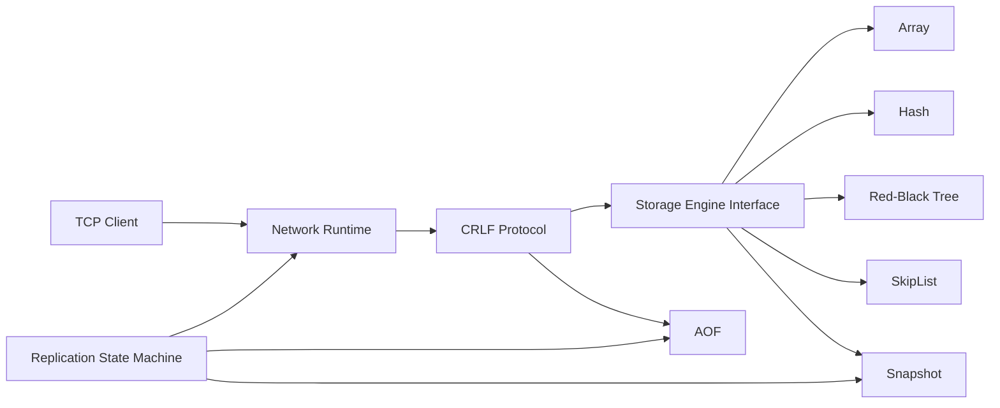

<div align="center">

# 91kvstore

**A Redis-inspired persistent key-value store written in C**

Storage Engines · TCP Streaming · AOF/Snapshot · Memory Pool · Replication

</div>

91kvstore 是一个运行在 Linux 上的 KV 存储系统，用于实践数据库核心链路：存储引擎、事件驱动网络、TCP 流式协议、持久化、内存管理和 Primary-Replica 复制。

项目目前支持四种存储引擎、三种网络模型、AOF + Snapshot 混合持久化，以及基于 Snapshot 和 AOF offset 的异步主从同步。

> 这是学习与实验项目，不建议用于生产环境。

## Features

- Array、Hash Table、Red-Black Tree、Skip List 四种内存引擎
- Reactor/epoll、Proactor/io_uring、NtyCo 协程三种网络模型
- CRLF 文本协议与批量命令
- TCP 粘包、半包和 partial send 处理
- AOF 实时追加与启动重放
- Snapshot 原子保存与基于 AOF offset 的增量恢复
- Hash、Red-Black Tree、Skip List 节点内存池
- AddressSanitizer 测试与 allocator benchmark
- Primary-Replica 异步复制
- Snapshot 全量同步、AOF 增量追赶与 ONLINE 实时同步
- Python、Go、JavaScript、Java、Rust 客户端示例

## Architecture


```mermaid
flowchart LR
    Client[TCP Client] --> Network[Network Runtime]
    Network --> Protocol[CRLF Protocol]
    Protocol --> Engine[Storage Engine Interface]

    Engine --> Array
    Engine --> Hash
    Engine --> RBTree[Red-Black Tree]
    Engine --> SkipList

    Protocol --> AOF
    Engine --> Snapshot

    Replication[Replication State Machine] --> Network
    Replication --> AOF
    Replication --> Snapshot
```

```text
src/engines/       Array / Hash / Red-Black Tree / Skip List
src/network/       Reactor / Proactor / NtyCo / buffer
src/persistence/   AOF / Snapshot
src/replication/   Primary-Replica replication
src/memory/        fixed-size node memory pool
```

## Quick Start

### Requirements

- Linux
- GCC with GNU C11 support
- GNU Make
- liburing
- pthread
- Git

Ubuntu/Debian：

```bash
sudo apt update
sudo apt install -y build-essential git liburing-dev netcat-openbsd
```

### Build

```bash
git clone --recursive https://github.com/JasperStonnne/91kvstore.git
cd 91kvstore
make
```

如果已经克隆但缺少 NtyCo 子模块：

```bash
git submodule update --init --recursive
```

### Standalone

```bash
./bin/kvstore 2000
```

连接服务：

```bash
nc 127.0.0.1 2000
```

```text
HSET username jasper
OK
HGET username
jasper
HMOD username stone
OK
HGET username
stone
```

`appendonly.aof` 和 `snapshot.db` 会保存在启动服务时的工作目录。

## Commands

命令前缀用于选择存储引擎：

| Operation | Array | Red-Black Tree | Hash Table | Skip List |
| --- | --- | --- | --- | --- |
| Create | `SET` | `RSET` | `HSET` | `SSET` |
| Read | `GET` | `RGET` | `HGET` | `SGET` |
| Update | `MOD` | `RMOD` | `HMOD` | `SMOD` |
| Delete | `DEL` | `RDEL` | `HDEL` | `SDEL` |
| Exists | `EXIST` | `REXIST` | `HEXIST` | `SEXIST` |

写入格式：

```text
HSET key value
```

查询格式：

```text
HGET key
```

`SET` 只创建不存在的键，修改已有值需要使用对应的 `MOD` 命令。键和值当前不能包含空格。

手动创建 Snapshot：

```text
SAVE
```

## Persistence

项目使用 Snapshot 保存全量状态，使用 AOF 记录后续写命令。

Snapshot 第一行记录保存时的 AOF byte offset：

```text
AOF_OFFSET 189
```

启动时按以下顺序恢复：

```text
load snapshot.db
    ↓
read AOF_OFFSET
    ↓
replay appendonly.aof from that offset
    ↓
start network service
```

Snapshot 使用临时文件写入并通过 `rename` 原子替换，避免不完整快照覆盖旧文件。

## Replication

当前实现采用异步 Primary-Replica 复制：Primary 不等待 Replica ACK 即可向客户端返回写入结果。

复制状态机：

```text
CONNECTING
    → HANDSHAKE (PING/PONG + PSYNC)
    → FULL_SYNC (Snapshot)
    → CATCH_UP (AOF from snapshot offset)
    → ONLINE (continuous AOF streaming)
```

### Run a Primary

```bash
mkdir -p /tmp/91kv-primary
cd /tmp/91kv-primary
/path/to/91kvstore/bin/kvstore primary 19000 19100
```

- `19000`：客户端服务端口
- `19100`：复制端口

### Run a Replica

```bash
mkdir -p /tmp/91kv-replica
cd /tmp/91kv-replica
/path/to/91kvstore/bin/kvstore replica 19001 127.0.0.1 19100
```

- `19001`：Replica 的客户端读取端口
- `127.0.0.1:19100`：Primary 复制地址

Primary 和 Replica 应使用不同工作目录，避免共用 AOF 和 Snapshot 文件。Replica 可以处理客户端读命令，但会拒绝客户端写命令。

## Networking Models

三种网络后端复用同一套协议与复制状态机：

| Backend | Model | ONLINE retry |
| --- | --- | --- |
| NtyCo | Coroutine | sleep/yield 后重新检查 AOF |
| Reactor | Readiness / epoll | `epoll_wait` timeout + `EPOLLOUT` |
| Proactor | Completion / io_uring | timeout SQE/CQE |

在 `include/kvstore.h` 中选择网络模型，默认使用 NtyCo：

```c
#define NETWORK_REACTOR  0
#define NETWORK_PROACTOR 1
#define NETWORK_NTYCO    2

#define NETWORK_SELECT NETWORK_NTYCO
```

修改后重新构建：

```bash
make clean && make
```

## Memory Pool

Hash、Red-Black Tree 和 Skip List 的固定大小节点外壳默认使用内存池；可变长度的 key/value、跳表 `forward` 数组等仍使用通用分配器。

```bash
make clean
make HASH_USE_MEMORY_POOL=0 \
     RBTREE_USE_MEMORY_POOL=0 \
     SKIPLIST_USE_MEMORY_POOL=0
```

| Variable | Default | Purpose |
| --- | ---: | --- |
| `HASH_USE_MEMORY_POOL` | `1` | Hash nodes |
| `RBTREE_USE_MEMORY_POOL` | `1` | Red-Black Tree nodes |
| `SKIPLIST_USE_MEMORY_POOL` | `1` | Skip List nodes |
| `ARRAY_USE_JEMALLOC` | `0` | Link jemalloc for Array benchmarks |

## Tests

主从复制集成测试：

```bash
./tests/test_replication.sh
```

测试覆盖：

```text
Primary startup
Replica ONLINE
Snapshot full synchronization
ONLINE incremental synchronization
```

内存与 ASan 测试：

```bash
make test-memory-pool
make test-hash-memory-pool
make test-rbtree-memory-pool
make test-skiplist-memory-pool
make test-array-memory
```

TCP testcase：

```bash
make testcase
./bin/testcase 127.0.0.1 2000 <mode>
```

Allocator benchmark 示例：

```bash
make HASH_USE_MEMORY_POOL=1 benchmark-hash
./bin/benchmark_hash_allocator

make HASH_USE_MEMORY_POOL=0 benchmark-hash
./bin/benchmark_hash_allocator
```

还提供 `benchmark-rbtree`、`benchmark-skiplist`、`benchmark-array` 和对应的 `*-memory` 目标。

## Project Layout

```text
91kvstore/
├── clients/                 # Multi-language TCP clients
├── include/                 # Public headers
├── src/
│   ├── engines/             # Storage engines
│   ├── memory/              # Memory pool
│   ├── network/             # Network backends and buffers
│   ├── persistence/         # AOF and Snapshot
│   ├── replication/         # Replication state machine
│   └── kvstore.c            # Command execution and entry point
├── tests/                   # Tests and benchmarks
├── third_party/NtyCo/       # Git submodule
└── Makefile
```

## Current Limitations

- Replica 尚未实现断线自动重连
- 尚未实现 replication backlog 和部分重同步
- 当前主要面向单 Replica 场景
- 尚未实现 ACK、心跳和自动故障转移
- Snapshot/AOF 文件操作可能阻塞单线程事件循环
- 尚未提供认证、TLS 和协议版本协商

## Roadmap

- 自动重连与退避
- 基于 replication ID 和 offset 的部分重同步
- 多 Replica 独立连接状态
- ACK、心跳与故障检测
- 后台 Snapshot 和 AOF rewrite
- 三种网络后端的自动化测试矩阵
- 认证、访问控制与 TLS

## License

This repository does not currently declare an open-source license. All rights are reserved until a license is published.
