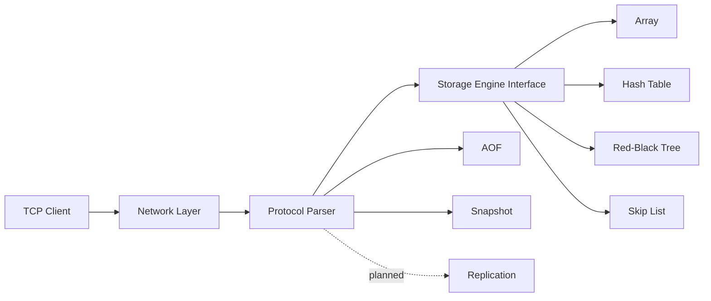

<div align="center">

```text
 █████╗  ██╗  ██╗  ██╗██╗   ██╗███████╗████████╗ ██████╗ ██████╗ ███████╗
██╔══██╗███║  ██║ ██╔╝██║   ██║██╔════╝╚══██╔══╝██╔═══██╗██╔══██╗██╔════╝
╚██████║╚██║  █████╔╝ ██║   ██║███████╗   ██║   ██║   ██║██████╔╝█████╗
 ╚═══██║ ██║  ██╔═██╗ ╚██╗ ██╔╝╚════██║   ██║   ██║   ██║██╔══██╗██╔══╝
 █████╔╝ ██║  ██║  ██╗ ╚████╔╝ ███████║   ██║   ╚██████╔╝██║  ██║███████╗
 ╚════╝  ╚═╝  ╚═╝  ╚═╝  ╚═══╝  ╚══════╝   ╚═╝    ╚═════╝ ╚═╝  ╚═╝╚══════╝
```

**A Redis-inspired persistent key-value storage system implemented in C**

Simple · Modular · Persistent · Measurable

[中文](#中文) · [English](#english)

</div>

---

<a id="中文"></a>

## 中文

91kvstore 是一个使用 C 语言实现的类 Redis 持久化 KV 存储系统，重点探索存储引擎、事件驱动网络、AOF/Snapshot 持久化、内存池管理和主从复制机制。

项目目标不是简单实现 `SET/GET` 命令，而是围绕一个 KV 数据库的核心路径进行系统化实践：请求如何被网络层接收、协议如何解析、数据如何被索引和持久化、节点对象如何高效分配、服务重启后如何恢复，以及后续如何通过复制机制扩展到多节点部署。

> 当前项目仍在迭代中，API、协议和内部实现可能随版本继续调整。

### 核心能力

- 四种内存存储引擎：Array、Hash Table、Red-Black Tree、Skip List
- 三种网络模型：Reactor、Proactor with io_uring、NtyCo 协程
- 基于 TCP 的轻量文本协议
- AOF 实时写入与启动重放
- Snapshot 手动快照与启动恢复
- Hash、Red-Black Tree、Skip List 节点内存池
- AddressSanitizer 内存检查与 allocator benchmark
- Python、Go、JavaScript、Java、Rust 客户端示例
- 主从复制机制正在开发中

### 设计亮点

- **可切换存储引擎**：抽象出 Array、Hash Table、Red-Black Tree、Skip List 四种索引结构，用于比较不同数据结构在读写场景下的性能和适用边界。
- **多网络模型对比**：支持 Reactor、io_uring Proactor 和 NtyCo 协程模型，便于比较不同并发 I/O 模型的实现复杂度和运行表现。
- **AOF + Snapshot 恢复路径**：服务启动时先加载快照，再从快照记录的 AOF offset 继续重放日志，避免每次都从完整 AOF 开始恢复。
- **节点级内存池**：为 Hash、Red-Black Tree、Skip List 的节点分配实现内存池，减少高频 `malloc/free` 带来的 allocator 开销。
- **可验证的工程实现**：通过功能测试、内存池测试、AddressSanitizer 和 benchmark 验证协议正确性、内存安全和模块性能。
- **复制机制演进中**：计划引入 replication log、全量同步、增量同步和 offset 续传，使单机 KVStore 扩展到主从架构。

### 架构概览


```mermaid
flowchart LR
    C[TCP Client] --> N[Network Layer]
    N --> P[Protocol Parser]
    P --> E[Storage Engine Interface]
    E --> A[Array]
    E --> H[Hash Table]
    E --> R[Red-Black Tree]
    E --> S[Skip List]
    P --> L[AOF]
    P --> D[Snapshot]
    P -. planned .-> Rep[Replication]
```

### 项目结构

```text
91kvstore/
├── clients/                 # 多语言 TCP 客户端示例
├── include/                 # 公共头文件
├── src/
│   ├── engines/             # Array / Hash / RBTree / SkipList
│   ├── memory/              # 节点内存池
│   ├── network/             # Reactor / Proactor / NtyCo
│   ├── persistence/         # AOF 与 Snapshot
│   └── kvstore.c            # 协议解析、初始化与程序入口
├── tests/                   # 功能测试与性能基准
├── third_party/NtyCo/       # NtyCo Git 子模块
└── Makefile
```

### 环境要求

当前版本面向 Linux 构建，使用 `epoll`、`io_uring` 等 Linux 接口。

- GCC with GNU C11 support
- GNU Make
- pthread
- liburing
- Git

Ubuntu/Debian：

```bash
sudo apt update
sudo apt install -y build-essential git liburing-dev
```

### 快速开始

```bash
git clone --recursive https://github.com/JasperStonnne/91kvstore.git
cd 91kvstore
make
./bin/kvstore 2000
```

如果仓库已经克隆但缺少子模块：

```bash
git submodule update --init --recursive
```

服务默认监听所有网络接口。`appendonly.aof` 和 `snapshot.db` 会从服务启动时的工作目录读取或写入。

使用 `nc` 连接：

```bash
nc 127.0.0.1 2000
```

```text
HSET username jasper
OK
HGET username
jasper
HMOD username stone
OK
HEXIST username
EXIST
HDEL username
OK
```

键和值当前应为不包含空格的文本。

### 命令协议

命令前缀决定请求使用的存储引擎：

| 操作 | Array | Red-Black Tree | Hash Table | Skip List |
| --- | --- | --- | --- | --- |
| 新增 | `SET key value` | `RSET key value` | `HSET key value` | `SSET key value` |
| 查询 | `GET key` | `RGET key` | `HGET key` | `SGET key` |
| 删除 | `DEL key` | `RDEL key` | `HDEL key` | `SDEL key` |
| 修改 | `MOD key value` | `RMOD key value` | `HMOD key value` | `SMOD key value` |
| 判断存在 | `EXIST key` | `REXIST key` | `HEXIST key` | `SEXIST key` |

`SET` 仅新增不存在的键；修改已有值需要使用对应的 `MOD` 命令。

| 响应 | 含义 |
| --- | --- |
| `OK` | 操作成功 |
| `EXIST` | 键已经存在，或存在性检查为真 |
| `NO EXIST` | 键不存在 |
| `ERROR` | 操作失败 |

创建数据快照：

```text
SAVE
```

快照保存在 `snapshot.db`。服务重启时会先加载快照，再从快照记录的位置继续重放 `appendonly.aof`。

### 网络模型

在 `include/kvstore.h` 中通过 `NETWORK_SELECT` 选择网络模型，当前默认为 NtyCo：

```c
#define NETWORK_REACTOR  0
#define NETWORK_PROACTOR 1
#define NETWORK_NTYCO    2

#define NETWORK_SELECT NETWORK_NTYCO
```

修改后执行：

```bash
make clean && make
```

### 内存池配置

Hash、Red-Black Tree 和 Skip List 默认启用节点内存池：

```bash
make clean
make HASH_USE_MEMORY_POOL=0 \
     RBTREE_USE_MEMORY_POOL=0 \
     SKIPLIST_USE_MEMORY_POOL=0
```

| Make 变量 | 默认值 | 作用 |
| --- | ---: | --- |
| `HASH_USE_MEMORY_POOL` | `1` | Hash 节点使用内存池 |
| `RBTREE_USE_MEMORY_POOL` | `1` | 红黑树节点使用内存池 |
| `SKIPLIST_USE_MEMORY_POOL` | `1` | 跳表节点使用内存池 |
| `ARRAY_USE_JEMALLOC` | `0` | Array 基准使用 jemalloc |

### 测试与 Benchmark

内存池与基础模块测试：

```bash
make test-memory-pool
make test-hash-memory-pool
make test-rbtree-memory-pool
make test-skiplist-memory-pool
make test-array-memory
```

TCP 功能与压力测试：

```bash
make testcase
./bin/testcase 127.0.0.1 2000 <mode>
```

| mode | 测试内容 |
| ---: | --- |
| `0` | 红黑树重复操作 |
| `1` | 红黑树批量键操作 |
| `2` | Array 重复操作 |
| `3` | Hash 分配与删除 |
| `4` | Skip List 重复操作 |

以内存池 benchmark 为例：

```bash
make HASH_USE_MEMORY_POOL=1 benchmark-hash
./bin/benchmark_hash_allocator

make HASH_USE_MEMORY_POOL=0 benchmark-hash
./bin/benchmark_hash_allocator
```

建议在稳定环境下补充以下结果表：

| Benchmark | Config | Result | Notes |
| --- | --- | ---: | --- |
| Hash allocator | memory pool on | TBD | node allocation benchmark |
| Hash allocator | malloc/free | TBD | baseline |
| RBTree allocator | memory pool on | TBD | node allocation benchmark |
| SkipList allocator | memory pool on | TBD | node allocation benchmark |
| TCP testcase | selected network model | TBD | request throughput / latency |

其他基准目标包括 `benchmark-rbtree`、`benchmark-skiplist`、`benchmark-array` 及对应的 `*-memory` 目标。

### 主从复制 Roadmap

主从同步模块正在设计和实现中，目标是将单机 KVStore 扩展为可复制的多节点系统。

计划支持：

- master 维护 replication log
- slave 初次连接时执行全量同步
- slave 根据 offset 拉取增量日志
- slave 断线重连后从上次 offset 继续同步
- 明确采用异步复制模型，优先保证实现清晰和可观测性

暂不计划在当前阶段实现 Raft、多主写入或强一致复制，避免项目复杂度过早膨胀。

### 开发状态

91kvstore 正在积极开发。正式生产版本发布前计划继续完善：

- 非法命令和参数的完整校验
- 自动化测试与 CI
- 并发安全和优雅退出
- AOF 重写、自动快照及可配置的数据目录
- 可复现的性能与稳定性测试报告
- 主从复制的全量同步、增量同步与故障恢复
- 统一的命令行客户端
- 身份认证、访问控制与加密传输

### License

本仓库目前尚未声明开源许可证。在许可证发布前，保留所有权利。

---

<a id="english"></a>

## English

91kvstore is a Redis-inspired persistent key-value storage system implemented in C. It focuses on storage engines, event-driven networking, AOF/Snapshot persistence, memory pool management, and master-slave replication.

The goal of this project is not only to implement basic `SET/GET` commands, but also to practice the core path of a KV database system: how requests are received by the network layer, how commands are parsed, how data is indexed and persisted, how node objects are allocated efficiently, how data is recovered after restart, and how the system can evolve toward replication.

> The project is actively evolving. APIs, protocols, and internal implementations may change over time.

### Core Capabilities

- Four in-memory storage engines: Array, Hash Table, Red-Black Tree, and Skip List
- Three networking models: Reactor, Proactor with io_uring, and NtyCo coroutines
- Lightweight TCP text protocol
- AOF write logging and replay on startup
- Manual snapshots and startup recovery
- Node memory pools for Hash, Red-Black Tree, and Skip List
- AddressSanitizer checks and allocator benchmarks
- Example clients in Python, Go, JavaScript, Java, and Rust
- Master-slave replication is under development

### Design Highlights

- **Switchable storage engines**: Array, Hash Table, Red-Black Tree, and Skip List are implemented as alternative index structures for comparing behavior under different access patterns.
- **Multiple networking models**: Reactor, io_uring Proactor, and NtyCo coroutine models are supported to compare implementation complexity and runtime behavior.
- **AOF + Snapshot recovery path**: On startup, the server loads the snapshot first and then replays AOF from the offset recorded in the snapshot.
- **Node-level memory pools**: Hash, Red-Black Tree, and Skip List nodes use custom memory pools to reduce allocator overhead from frequent `malloc/free`.
- **Verifiable implementation**: Functional tests, memory pool tests, AddressSanitizer, and benchmarks are used to validate correctness, memory safety, and module performance.
- **Replication evolution**: The replication design is planned around replication logs, full synchronization, incremental synchronization, and offset-based reconnection.

### Architecture


```mermaid
flowchart LR
    C[TCP Client] --> N[Network Layer]
    N --> P[Protocol Parser]
    P --> E[Storage Engine Interface]
    E --> A[Array]
    E --> H[Hash Table]
    E --> R[Red-Black Tree]
    E --> S[Skip List]
    P --> L[AOF]
    P --> D[Snapshot]
    P -. planned .-> Rep[Replication]
```

### Project Layout

```text
91kvstore/
├── clients/                 # TCP client examples in multiple languages
├── include/                 # Public headers
├── src/
│   ├── engines/             # Array / Hash / RBTree / SkipList
│   ├── memory/              # Node memory pools
│   ├── network/             # Reactor / Proactor / NtyCo
│   ├── persistence/         # AOF and Snapshot
│   └── kvstore.c            # Protocol parsing, initialization, entry point
├── tests/                   # Functional tests and benchmarks
├── third_party/NtyCo/       # NtyCo Git submodule
└── Makefile
```

### Requirements

The current version targets Linux and uses APIs such as `epoll` and `io_uring`.

- GCC with GNU C11 support
- GNU Make
- pthread
- liburing
- Git

On Ubuntu/Debian:

```bash
sudo apt update
sudo apt install -y build-essential git liburing-dev
```

### Quick Start

```bash
git clone --recursive https://github.com/JasperStonnne/91kvstore.git
cd 91kvstore
make
./bin/kvstore 2000
```

If the repository was cloned without submodules:

```bash
git submodule update --init --recursive
```

The server listens on all network interfaces. `appendonly.aof` and `snapshot.db` are read from and written to the working directory in which the server is started.

Connect with `nc`:

```bash
nc 127.0.0.1 2000
```

```text
HSET username jasper
OK
HGET username
jasper
HMOD username stone
OK
HEXIST username
EXIST
HDEL username
OK
```

Keys and values currently need to be text without spaces.

### Command Protocol

The command prefix selects the storage engine:

| Operation | Array | Red-Black Tree | Hash Table | Skip List |
| --- | --- | --- | --- | --- |
| Create | `SET key value` | `RSET key value` | `HSET key value` | `SSET key value` |
| Read | `GET key` | `RGET key` | `HGET key` | `SGET key` |
| Delete | `DEL key` | `RDEL key` | `HDEL key` | `SDEL key` |
| Update | `MOD key value` | `RMOD key value` | `HMOD key value` | `SMOD key value` |
| Check existence | `EXIST key` | `REXIST key` | `HEXIST key` | `SEXIST key` |

`SET` only creates a key that does not already exist. Use the corresponding `MOD` command to update an existing value.

| Response | Meaning |
| --- | --- |
| `OK` | The operation succeeded |
| `EXIST` | The key already exists, or an existence check is true |
| `NO EXIST` | The key does not exist |
| `ERROR` | The operation failed |

Create a snapshot with:

```text
SAVE
```

The snapshot is stored in `snapshot.db`. On restart, the server loads the snapshot first and resumes replaying `appendonly.aof` from the offset recorded in the snapshot.

### Selecting a Networking Model

Set `NETWORK_SELECT` in `include/kvstore.h`. NtyCo is currently the default:

```c
#define NETWORK_REACTOR  0
#define NETWORK_PROACTOR 1
#define NETWORK_NTYCO    2

#define NETWORK_SELECT NETWORK_NTYCO
```

Run the following command after changing the selection:

```bash
make clean && make
```

### Memory Pool Configuration

Node memory pools are enabled by default for Hash, Red-Black Tree, and Skip List:

```bash
make clean
make HASH_USE_MEMORY_POOL=0 \
     RBTREE_USE_MEMORY_POOL=0 \
     SKIPLIST_USE_MEMORY_POOL=0
```

| Make variable | Default | Purpose |
| --- | ---: | --- |
| `HASH_USE_MEMORY_POOL` | `1` | Use the node pool for Hash |
| `RBTREE_USE_MEMORY_POOL` | `1` | Use the node pool for Red-Black Tree |
| `SKIPLIST_USE_MEMORY_POOL` | `1` | Use the node pool for Skip List |
| `ARRAY_USE_JEMALLOC` | `0` | Use jemalloc in Array benchmarks |

### Tests and Benchmarks

Memory pool and module tests:

```bash
make test-memory-pool
make test-hash-memory-pool
make test-rbtree-memory-pool
make test-skiplist-memory-pool
make test-array-memory
```

TCP functional and load tests:

```bash
make testcase
./bin/testcase 127.0.0.1 2000 <mode>
```

| mode | Test |
| ---: | --- |
| `0` | Repeated Red-Black Tree operations |
| `1` | Batched Red-Black Tree keys |
| `2` | Repeated Array operations |
| `3` | Hash allocation and deletion |
| `4` | Repeated Skip List operations |

Allocator benchmark example:

```bash
make HASH_USE_MEMORY_POOL=1 benchmark-hash
./bin/benchmark_hash_allocator

make HASH_USE_MEMORY_POOL=0 benchmark-hash
./bin/benchmark_hash_allocator
```

Suggested result table:

| Benchmark | Config | Result | Notes |
| --- | --- | ---: | --- |
| Hash allocator | memory pool on | TBD | node allocation benchmark |
| Hash allocator | malloc/free | TBD | baseline |
| RBTree allocator | memory pool on | TBD | node allocation benchmark |
| SkipList allocator | memory pool on | TBD | node allocation benchmark |
| TCP testcase | selected network model | TBD | request throughput / latency |

Additional targets include `benchmark-rbtree`, `benchmark-skiplist`, `benchmark-array`, and their corresponding `*-memory` targets.

### Replication Roadmap

The replication module is under design and implementation. The goal is to evolve the single-node KVStore into a replicated multi-node system.

Planned features:

- The master maintains a replication log
- A slave performs full synchronization on first connection
- A slave fetches incremental logs by offset
- A disconnected slave resumes from its last offset after reconnection
- The replication model is asynchronous by design

Raft, multi-master writes, and strong consistency are intentionally out of scope for the current stage to keep the project focused and explainable.

### Development Status

91kvstore is under active development. The following areas are planned before a production release:

- Complete validation for malformed commands and arguments
- Automated tests and CI
- Concurrency safety and graceful shutdown
- AOF rewriting, automatic snapshots, and configurable data paths
- Reproducible performance and stability reports
- Full synchronization, incremental synchronization, and recovery for replication
- A unified command-line client
- Authentication, access control, and encrypted transport

### License

This repository does not currently declare an open-source license. All rights are reserved until a license is published.
